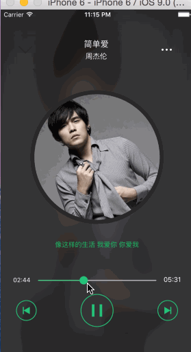
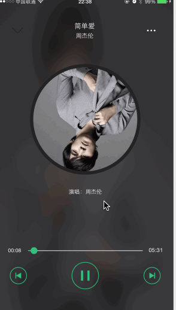

# QQMusic

   这是一个音乐播放器的Demo，支持歌词解析并滚动展示，另外支持后台播放以及后台播放图片歌词的绘制， 最重要的是它是用Swift4.1写的哦!

##  运行环境环境：Xcode9 + Swift 4.1


## 播放页面   
     


## 后台播放页面      


     

  
### 一：动画的暂停与恢复
```objc
   /**暂停动画*/
    func pauseAnimate(){

        let pausedTime = convertTime(CACurrentMediaTime(), fromLayer: nil)
        speed = 0.0
        timeOffset = pausedTime
    }
    /**恢复动画*/
    func resumeAnimate(){
        let pausedTime = timeOffset
        speed = 1.0
        timeOffset = 0.0
        beginTime = 0.0
        let timeSincePause = convertTime(CACurrentMediaTime(), fromLayer: nil) - pausedTime
        beginTime = timeSincePause
    }
```
### 二：对Label文字的绘制
```objc
    override func drawRect(rect: CGRect) {
        super.drawRect(rect)

        let fillRect = CGRectMake(0, 0, bounds.size.width * progress!, bounds.size.height)

        UIColor(red: 38/255.0, green: 187/255.0, blue: 102/255.0, alpha: 1.0).set()

        UIRectFillUsingBlendMode(fillRect, .SourceIn)
    }
```
### 三：对后台歌曲图片的歌词水印的绘制
```objc
  /**
    根据文字的高度和传来的文字来生成水印文字

    :param: titleH      文字的高度
    :param: currText    中间行的文字
    :param: prevousText 上一行
    :param: nextText    下一行

    :returns: 返回的图片
    */
    func setImageWithString(titleH:CGFloat  ,currText:NSString,prevousText:NSString?,nextText:NSString?) -> UIImage {
        //获取图像上下文
        UIGraphicsBeginImageContext(size)
        //将图像画上去
        self.drawInRect(CGRectMake(0, 0, size.width, size.height))
        let style = NSMutableParagraphStyle()

        style.alignment = .Center
        let currTextAttributes = [
            NSFontAttributeName:UIFont.systemFontOfSize(18),
            NSForegroundColorAttributeName:UIColor(red: 38/255.0, green: 187/255.0, blue: 102/255.0, alpha: 1.0),
            NSParagraphStyleAttributeName:style
        ]

        let otherTextAttributes = [
            NSFontAttributeName:UIFont.systemFontOfSize(16),
            NSForegroundColorAttributeName:UIColor.whiteColor(),
            NSParagraphStyleAttributeName:style
        ]
        //当前行
        currText.drawInRect(CGRectMake(0, size.height - (titleH * 2), size.width, size.height), withAttributes: currTextAttributes)

        prevousText!.drawInRect(CGRectMake(0, size.height - (titleH * 3), size.width, size.height), withAttributes: otherTextAttributes)
        nextText!.drawInRect(CGRectMake(0, size.height - titleH, size.width, size.height), withAttributes: otherTextAttributes)
        //生成图片
        let textImage = UIGraphicsGetImageFromCurrentImageContext()
        //关闭上下文
        UIGraphicsEndImageContext()
       return textImage
    }
```
### 四：激活后台播放
```objc
   /// 设置后台播放
    class func setupBackPlay() {
        //获取音频回话
        let session = AVAudioSession.sharedInstance()
        //设置后台播放
        try! session.setCategory(AVAudioSessionCategoryPlayback)
        //激活后台播放
        try! session.setActive(true)
    }
```
### 五：设置后台播放事件内容
```objc
class func setupLockScreenInfoWithLockImage(lockImage:UIImage,duration:NSTimeInterval, currTime: NSTimeInterval) {
        //获取当前播放的歌曲
        let playingMusic = WMMusicTool.playerMusic()
        //获取锁屏界面中心
        let playingInfoCenter = MPNowPlayingInfoCenter.defaultCenter()
        //设置需要展示的信息
        let artWord = MPMediaItemArtwork(image: lockImage)

        let playingInfo = [
            MPMediaItemPropertyAlbumTitle: playingMusic.name!,
            MPMediaItemPropertyAlbumArtist: playingMusic.singer!,
            MPMediaItemPropertyArtwork: artWord,
            MPMediaItemPropertyPlaybackDuration: duration,
            MPNowPlayingInfoPropertyElapsedPlaybackTime: currTime
        ]
        playingInfoCenter.nowPlayingInfo = playingInfo
        //接受远程事件
        UIApplication.sharedApplication().beginReceivingRemoteControlEvents()

    }

```
### 六：监听远程事件
```objc
//监听远程事件
    override func remoteControlReceivedWithEvent(event: UIEvent?) {
        switch(event!.subtype) {
        case .RemoteControlPlay:
            playSong()
        case .RemoteControlPause:
            playSong()
        case .RemoteControlNextTrack:
            nextSong()
        case .RemoteControlPreviousTrack:
            preSong()
        default:
            break
        }
    }

```
